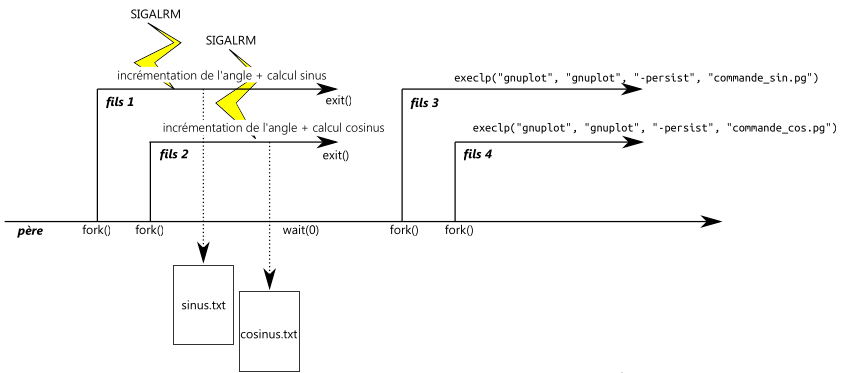

# TP 02 - Génération Périodique de Données

**Auteur**: Raquel Maciel Coelho de Sousa 
**Turme**: 2026  
**Cours**: Systèmes d'exploitation  
**TP groupe**: 4  

## Compilation

Pour compiler le programme, assurez-vous d'être dans le dossier `tp02` et exécutez la commande suivante:

```bash
make
```

Cela générera un exécutable nommé `main`.

## Exécution

Pour exécuter le programme, lancez simplement :

```bash
./main
```




## Nettoyage

Pour supprimer les fichiers objets et l'exécutable, utilisez la commande :

```bash
make clean
```